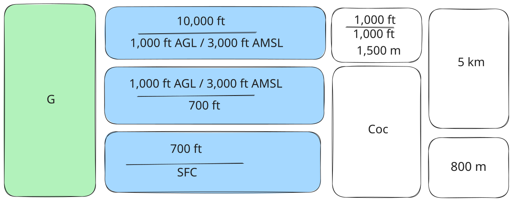
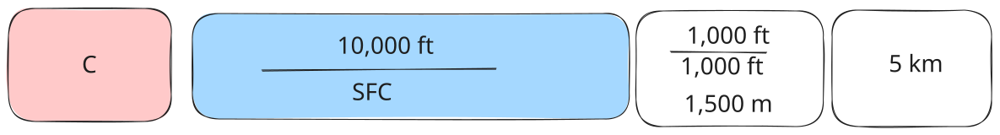

# Visual Meteorological Conditions

## Class G Airspace (Uncontrolled Aerodromes)

Below 700 ft AGL:

- Clear of cloud and in sight of the surface

- Flight visibility 800 m

- At a speed to avoid collision

Below 3,000 ft AMSL or 1,000 ft AGL, whichever is higher:

- Clear of cloud and in sight of the surface

- Flight visibility 5 km

above 3,000 ft AMSL or 1,000 ft AGL whichever is higher:

- 1,500 m horizontally and 1,000 ft above or below cloud

- Flight visibility 5 km below 10,000 ft and 8 km above 10,000 ft

## Class C Airspace (Major Aerodromes)

- 1,500 m horizontally and 1,000 ft above or below cloud

- Flight visibility 5 km below 10,000 ft and 8 km above 10,000 ft

## Class D Airspace (Regional Aerodromes)

- 600 m horizontally, 1,000 ft above and 500 ft below cloud

- Flight visibility 5 km

## Special VFR

By day only, on request, ATC may issue a "special VFR clearance" that will allow you to fly below VMC if you:

- At a speed to avoid collision

- Keep clear of cloud

- Flight visibility 800 m
